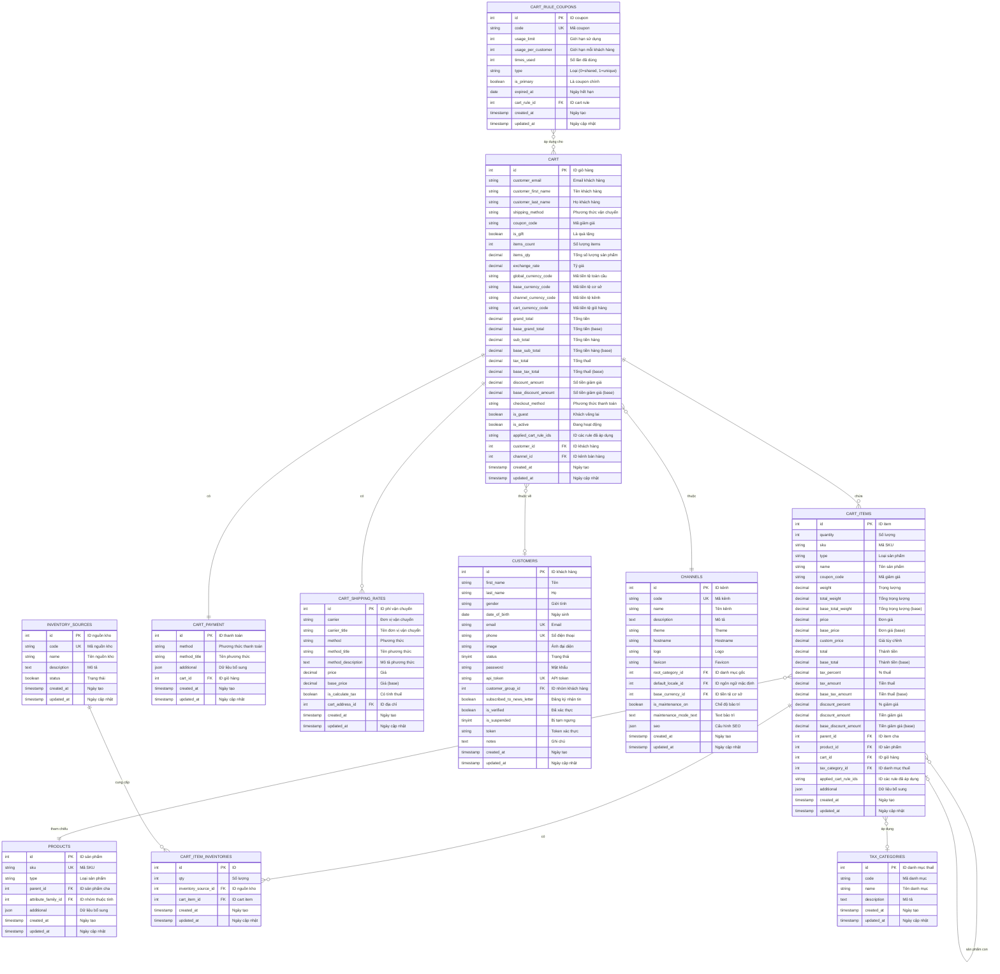

# ERD - SHOPPING CART (Giỏ hàng)

## Sơ đồ ERD mức khái niệm

## Mô tả các bảng chính

### 1. CART (Giỏ hàng)
- Lưu trữ thông tin tổng quan về giỏ hàng
- Hỗ trợ cả khách hàng đã đăng nhập và khách vãng lai
- Tính toán tự động tổng tiền, thuế, giảm giá
- Hỗ trợ đa tiền tệ và đa kênh

### 2. CART_ITEMS (Sản phẩm trong giỏ)
- Chi tiết từng sản phẩm trong giỏ hàng
- Hỗ trợ sản phẩm phức tạp (configurable, bundle) qua parent_id
- Tính toán giá, thuế, giảm giá cho từng item
- Lưu trữ thông tin snapshot của sản phẩm (tránh thay đổi giá)

### 3. CART_PAYMENT (Thanh toán)
- Lưu phương thức thanh toán được chọn
- Hỗ trợ nhiều loại payment gateway

### 4. CART_SHIPPING_RATES (Phí vận chuyển)
- Lưu các lựa chọn phí vận chuyển khả dụng
- Tính toán dựa trên địa chỉ và carrier

### 5. CART_ITEM_INVENTORIES (Phân bổ tồn kho)
- Quản lý phân bổ số lượng từ các nguồn kho khác nhau
- Hỗ trợ multi-warehouse fulfillment

## Quy trình nghiệp vụ

1. **Thêm sản phẩm vào giỏ**:
   - Tạo/cập nhật CART
   - Thêm CART_ITEMS
   - Phân bổ CART_ITEM_INVENTORIES
   - Áp dụng CART_RULE_COUPONS (nếu có)
   - Tính toán lại tổng tiền

2. **Cập nhật giỏ hàng**:
   - Thay đổi số lượng CART_ITEMS
   - Cập nhật CART_ITEM_INVENTORIES
   - Tính toán lại thuế, giảm giá
   - Cập nhật CART totals

3. **Checkout**:
   - Chọn phương thức vận chuyển (CART_SHIPPING_RATES)
   - Chọn phương thức thanh toán (CART_PAYMENT)
   - Xác thực tồn kho
   - Chuyển đổi thành ORDER

## Các ràng buộc quan trọng

- Mỗi CART chỉ có một CART_PAYMENT duy nhất
- CART_ITEMS phải tham chiếu đến PRODUCTS tồn tại
- Tổng quantity của CART_ITEM_INVENTORIES phải bằng quantity của CART_ITEMS
- Giá trong CART_ITEMS là snapshot, không tự động cập nhật theo PRODUCTS
