# ERD - ORDER MANAGEMENT (Quản lý đơn hàng)

## Sơ đồ ERD mức khái niệm

```mermaid
erDiagram
    ORDERS ||--o{ ORDER_ITEMS : "chứa"
    ORDERS ||--|| ORDER_PAYMENT : "có"
    ORDERS }o--o| CUSTOMERS : "thuộc về"
    ORDERS }o--|| CHANNELS : "thuộc"
    ORDERS ||--o{ INVOICES : "được lập"
    ORDERS ||--o{ SHIPMENTS : "được giao"
    ORDERS ||--o{ REFUNDS : "được hoàn"
    ORDER_ITEMS }o--|| PRODUCTS : "tham chiếu"
    ORDER_ITEMS }o--o| ORDER_ITEMS : "item cha"
    ORDER_ITEMS }o--o| TAX_CATEGORIES : "áp dụng"
    INVOICES ||--o{ INVOICE_ITEMS : "chứa"
    SHIPMENTS ||--o{ SHIPMENT_ITEMS : "chứa"
    REFUNDS ||--o{ REFUND_ITEMS : "chứa"
    INVOICE_ITEMS }o--|| ORDER_ITEMS : "từ"
    SHIPMENT_ITEMS }o--|| ORDER_ITEMS : "từ"
    REFUND_ITEMS }o--|| ORDER_ITEMS : "từ"

    ORDERS {
        int id PK "ID đơn hàng"
        string increment_id UK "Mã đơn hàng"
        string status "Trạng thái (pending, processing, completed, canceled...)"
        string channel_name "Tên kênh"
        boolean is_guest "Đơn khách vãng lai"
        string customer_email "Email khách hàng"
        string customer_first_name "Tên khách hàng"
        string customer_last_name "Họ khách hàng"
        string shipping_method "Phương thức vận chuyển"
        string shipping_title "Tên phương thức VC"
        string shipping_description "Mô tả VC"
        string coupon_code "Mã giảm giá"
        boolean is_gift "Là quà tặng"
        int total_item_count "Tổng số mặt hàng"
        int total_qty_ordered "Tổng số lượng đặt"
        string base_currency_code "Mã tiền tệ cơ sở"
        string channel_currency_code "Mã tiền tệ kênh"
        string order_currency_code "Mã tiền tệ đơn hàng"
        decimal grand_total "Tổng tiền"
        decimal base_grand_total "Tổng tiền (base)"
        decimal grand_total_invoiced "Tổng tiền đã lập hóa đơn"
        decimal base_grand_total_invoiced "Tổng tiền đã lập HD (base)"
        decimal grand_total_refunded "Tổng tiền đã hoàn"
        decimal base_grand_total_refunded "Tổng tiền đã hoàn (base)"
        decimal sub_total "Tổng tiền hàng"
        decimal base_sub_total "Tổng tiền hàng (base)"
        decimal sub_total_invoiced "Tiền hàng đã lập HD"
        decimal base_sub_total_invoiced "Tiền hàng đã lập HD (base)"
        decimal sub_total_refunded "Tiền hàng đã hoàn"
        decimal base_sub_total_refunded "Tiền hàng đã hoàn (base)"
        decimal discount_percent "% giảm giá"
        decimal discount_amount "Tiền giảm giá"
        decimal base_discount_amount "Tiền giảm giá (base)"
        decimal discount_invoiced "Giảm giá đã lập HD"
        decimal base_discount_invoiced "Giảm giá đã lập HD (base)"
        decimal discount_refunded "Giảm giá đã hoàn"
        decimal base_discount_refunded "Giảm giá đã hoàn (base)"
        decimal tax_amount "Tiền thuế"
        decimal base_tax_amount "Tiền thuế (base)"
        decimal tax_amount_invoiced "Thuế đã lập HD"
        decimal base_tax_amount_invoiced "Thuế đã lập HD (base)"
        decimal tax_amount_refunded "Thuế đã hoàn"
        decimal base_tax_amount_refunded "Thuế đã hoàn (base)"
        decimal shipping_amount "Phí vận chuyển"
        decimal base_shipping_amount "Phí VC (base)"
        decimal shipping_invoiced "Phí VC đã lập HD"
        decimal base_shipping_invoiced "Phí VC đã lập HD (base)"
        decimal shipping_refunded "Phí VC đã hoàn"
        decimal base_shipping_refunded "Phí VC đã hoàn (base)"
        decimal shipping_discount_amount "Giảm giá phí VC"
        decimal base_shipping_discount_amount "Giảm giá phí VC (base)"
        int customer_id FK "ID khách hàng"
        string customer_type "Loại khách hàng"
        int channel_id FK "ID kênh"
        string channel_type "Loại kênh"
        int cart_id "ID giỏ hàng gốc"
        string applied_cart_rule_ids "Các rule đã áp dụng"
        timestamp created_at "Ngày tạo"
        timestamp updated_at "Ngày cập nhật"
    }

    ORDER_ITEMS {
        int id PK "ID order item"
        string sku "Mã SKU"
        string type "Loại sản phẩm"
        string name "Tên sản phẩm"
        string coupon_code "Mã giảm giá"
        decimal weight "Trọng lượng"
        decimal total_weight "Tổng trọng lượng"
        int qty_ordered "Số lượng đặt"
        int qty_shipped "Số lượng đã giao"
        int qty_invoiced "Số lượng đã lập HD"
        int qty_canceled "Số lượng đã hủy"
        int qty_refunded "Số lượng đã hoàn"
        decimal price "Đơn giá"
        decimal base_price "Đơn giá (base)"
        decimal total "Thành tiền"
        decimal base_total "Thành tiền (base)"
        decimal total_invoiced "Tiền đã lập HD"
        decimal base_total_invoiced "Tiền đã lập HD (base)"
        decimal amount_refunded "Tiền đã hoàn"
        decimal base_amount_refunded "Tiền đã hoàn (base)"
        decimal discount_percent "% giảm giá"
        decimal discount_amount "Tiền giảm giá"
        decimal base_discount_amount "Tiền giảm giá (base)"
        decimal discount_invoiced "Giảm giá đã lập HD"
        decimal base_discount_invoiced "Giảm giá đã lập HD (base)"
        decimal discount_refunded "Giảm giá đã hoàn"
        decimal base_discount_refunded "Giảm giá đã hoàn (base)"
        decimal tax_percent "% thuế"
        decimal tax_amount "Tiền thuế"
        decimal base_tax_amount "Tiền thuế (base)"
        decimal tax_amount_invoiced "Thuế đã lập HD"
        decimal base_tax_amount_invoiced "Thuế đã lập HD (base)"
        decimal tax_amount_refunded "Thuế đã hoàn"
        decimal base_tax_amount_refunded "Thuế đã hoàn (base)"
        int product_id FK "ID sản phẩm"
        string product_type "Loại sản phẩm"
        int order_id FK "ID đơn hàng"
        int tax_category_id FK "ID danh mục thuế"
        int parent_id FK "ID item cha"
        json additional "Dữ liệu bổ sung"
        timestamp created_at "Ngày tạo"
        timestamp updated_at "Ngày cập nhật"
    }

    ORDER_PAYMENT {
        int id PK "ID thanh toán"
        int order_id FK "ID đơn hàng"
        string method "Phương thức thanh toán"
        string method_title "Tên phương thức"
        json additional "Dữ liệu bổ sung (payment gateway info)"
        timestamp created_at "Ngày tạo"
        timestamp updated_at "Ngày cập nhật"
    }

    INVOICES {
        int id PK "ID hóa đơn"
        string increment_id "Mã hóa đơn"
        string state "Trạng thái (pending, paid)"
        boolean email_sent "Đã gửi email"
        int total_qty "Tổng số lượng"
        string base_currency_code "Mã tiền tệ cơ sở"
        string channel_currency_code "Mã tiền tệ kênh"
        string order_currency_code "Mã tiền tệ đơn hàng"
        decimal sub_total "Tổng tiền hàng"
        decimal base_sub_total "Tổng tiền hàng (base)"
        decimal grand_total "Tổng tiền"
        decimal base_grand_total "Tổng tiền (base)"
        decimal shipping_amount "Phí vận chuyển"
        decimal base_shipping_amount "Phí VC (base)"
        decimal tax_amount "Tiền thuế"
        decimal base_tax_amount "Tiền thuế (base)"
        decimal discount_amount "Tiền giảm giá"
        decimal base_discount_amount "Tiền giảm giá (base)"
        int order_id FK "ID đơn hàng"
        string transaction_id "ID giao dịch thanh toán"
        int reminders "Số lần nhắc nhở"
        timestamp next_reminder_at "Thời gian nhắc nhở tiếp"
        timestamp created_at "Ngày tạo"
        timestamp updated_at "Ngày cập nhật"
    }

    INVOICE_ITEMS {
        int id PK "ID invoice item"
        string sku "Mã SKU"
        string type "Loại sản phẩm"
        string name "Tên sản phẩm"
        text description "Mô tả"
        int qty "Số lượng"
        decimal price "Đơn giá"
        decimal base_price "Đơn giá (base)"
        decimal total "Thành tiền"
        decimal base_total "Thành tiền (base)"
        decimal tax_amount "Tiền thuế"
        decimal base_tax_amount "Tiền thuế (base)"
        decimal discount_amount "Tiền giảm giá"
        decimal base_discount_amount "Tiền giảm giá (base)"
        int product_id FK "ID sản phẩm"
        string product_type "Loại sản phẩm"
        int order_item_id FK "ID order item"
        int invoice_id FK "ID hóa đơn"
        int parent_id FK "ID item cha"
        json additional "Dữ liệu bổ sung"
        timestamp created_at "Ngày tạo"
        timestamp updated_at "Ngày cập nhật"
    }

    SHIPMENTS {
        int id PK "ID vận đơn"
        string increment_id "Mã vận đơn"
        string status "Trạng thái"
        int total_qty "Tổng số lượng"
        int total_weight "Tổng trọng lượng"
        string carrier_code "Mã đơn vị vận chuyển"
        string carrier_title "Tên đơn vị VC"
        string track_number "Mã tracking"
        boolean email_sent "Đã gửi email"
        int customer_id FK "ID khách hàng"
        string customer_type "Loại khách hàng"
        int order_id FK "ID đơn hàng"
        int inventory_source_id FK "ID nguồn kho"
        string inventory_source_name "Tên nguồn kho"
        timestamp created_at "Ngày tạo"
        timestamp updated_at "Ngày cập nhật"
    }

    SHIPMENT_ITEMS {
        int id PK "ID shipment item"
        string name "Tên sản phẩm"
        text description "Mô tả"
        string sku "Mã SKU"
        int qty "Số lượng"
        decimal weight "Trọng lượng"
        decimal price "Đơn giá"
        decimal base_price "Đơn giá (base)"
        decimal total "Thành tiền"
        decimal base_total "Thành tiền (base)"
        int product_id FK "ID sản phẩm"
        string product_type "Loại sản phẩm"
        int order_item_id FK "ID order item"
        int shipment_id FK "ID vận đơn"
        json additional "Dữ liệu bổ sung"
        timestamp created_at "Ngày tạo"
        timestamp updated_at "Ngày cập nhật"
    }

    REFUNDS {
        int id PK "ID phiếu hoàn"
        string increment_id "Mã phiếu hoàn"
        string state "Trạng thái"
        boolean email_sent "Đã gửi email"
        int total_qty "Tổng số lượng"
        string base_currency_code "Mã tiền tệ cơ sở"
        string channel_currency_code "Mã tiền tệ kênh"
        string order_currency_code "Mã tiền tệ đơn hàng"
        decimal adjustment_refund "Điều chỉnh hoàn"
        decimal base_adjustment_refund "Điều chỉnh hoàn (base)"
        decimal adjustment_fee "Phí điều chỉnh"
        decimal base_adjustment_fee "Phí điều chỉnh (base)"
        decimal sub_total "Tổng tiền hàng"
        decimal base_sub_total "Tổng tiền hàng (base)"
        decimal grand_total "Tổng tiền"
        decimal base_grand_total "Tổng tiền (base)"
        decimal shipping_amount "Phí vận chuyển"
        decimal base_shipping_amount "Phí VC (base)"
        decimal tax_amount "Tiền thuế"
        decimal base_tax_amount "Tiền thuế (base)"
        decimal discount_amount "Tiền giảm giá"
        decimal base_discount_amount "Tiền giảm giá (base)"
        int order_id FK "ID đơn hàng"
        timestamp created_at "Ngày tạo"
        timestamp updated_at "Ngày cập nhật"
    }

    REFUND_ITEMS {
        int id PK "ID refund item"
        string name "Tên sản phẩm"
        text description "Mô tả"
        string sku "Mã SKU"
        int qty "Số lượng"
        decimal price "Đơn giá"
        decimal base_price "Đơn giá (base)"
        decimal total "Thành tiền"
        decimal base_total "Thành tiền (base)"
        decimal tax_amount "Tiền thuế"
        decimal base_tax_amount "Tiền thuế (base)"
        decimal discount_amount "Tiền giảm giá"
        decimal base_discount_amount "Tiền giảm giá (base)"
        int product_id FK "ID sản phẩm"
        string product_type "Loại sản phẩm"
        int order_item_id FK "ID order item"
        int refund_id FK "ID phiếu hoàn"
        int parent_id FK "ID item cha"
        json additional "Dữ liệu bổ sung"
        timestamp created_at "Ngày tạo"
        timestamp updated_at "Ngày cập nhật"
    }

    CUSTOMERS {
        int id PK "ID khách hàng"
        string first_name "Tên"
        string last_name "Họ"
        string email UK "Email"
        string phone UK "Số điện thoại"
        tinyint status "Trạng thái"
        timestamp created_at "Ngày tạo"
        timestamp updated_at "Ngày cập nhật"
    }

    PRODUCTS {
        int id PK "ID sản phẩm"
        string sku UK "Mã SKU"
        string type "Loại sản phẩm"
        timestamp created_at "Ngày tạo"
        timestamp updated_at "Ngày cập nhật"
    }

    CHANNELS {
        int id PK "ID kênh"
        string code UK "Mã kênh"
        string name "Tên kênh"
        timestamp created_at "Ngày tạo"
        timestamp updated_at "Ngày cập nhật"
    }

    TAX_CATEGORIES {
        int id PK "ID danh mục thuế"
        string code "Mã danh mục"
        string name "Tên danh mục"
        timestamp created_at "Ngày tạo"
        timestamp updated_at "Ngày cập nhật"
    }
```



## Mô tả các bảng chính

### 1. ORDERS (Đơn hàng)
- Bảng trung tâm quản lý đơn hàng
- Lưu trữ tất cả thông tin tổng hợp: giá, thuế, giảm giá, vận chuyển
- Tracking các trạng thái: pending, processing, completed, canceled, closed
- Tracking các số tiền đã invoiced, shipped, refunded

### 2. ORDER_ITEMS (Chi tiết đơn hàng)
- Chi tiết từng sản phẩm trong đơn hàng
- Tracking số lượng: ordered, shipped, invoiced, canceled, refunded
- Lưu snapshot giá tại thời điểm đặt hàng
- Hỗ trợ sản phẩm phức tạp qua parent_id

### 3. INVOICES (Hóa đơn)
- Quản lý hóa đơn phát hành cho đơn hàng
- Một đơn hàng có thể có nhiều invoice (partial invoicing)
- Tracking trạng thái thanh toán
- Hỗ trợ gửi email và nhắc nhở thanh toán

### 4. SHIPMENTS (Vận đơn)
- Quản lý quá trình giao hàng
- Một đơn hàng có thể có nhiều shipment (partial shipping)
- Tracking thông tin vận chuyển và warehouse

### 5. REFUNDS (Phiếu hoàn trả)
- Quản lý quá trình hoàn tiền/hàng
- Hỗ trợ partial refund
- Có thể điều chỉnh số tiền hoàn và phí

## Quy trình nghiệp vụ

### Luồng đơn hàng chuẩn:
```
CART → ORDER (pending) 
     → ORDER (processing) + INVOICE (pending)
     → SHIPMENT + INVOICE (paid)
     → ORDER (completed)
```

### Luồng hoàn hàng:
```
ORDER (completed) 
     → REFUND (requested)
     → REFUND (approved)
     → ORDER (closed)
```

## Các trạng thái quan trọng

### Order Status:
- `pending`: Đơn hàng mới tạo, chờ xử lý
- `processing`: Đang xử lý (đã thanh toán)
- `completed`: Hoàn tất
- `canceled`: Đã hủy
- `closed`: Đã đóng (sau khi hoàn trả)

### Invoice State:
- `pending`: Chờ thanh toán
- `paid`: Đã thanh toán

### Shipment Status:
- `pending`: Chờ giao hàng
- `shipped`: Đã giao
- `delivered`: Đã nhận

### Refund State:
- `pending`: Chờ duyệt
- `approved`: Đã duyệt
- `rejected`: Từ chối

## Ràng buộc tính toán

- `qty_shipped + qty_canceled + qty_refunded ≤ qty_ordered`
- `grand_total = sub_total + tax_amount + shipping_amount - discount_amount`
- `grand_total_invoiced + grand_total_refunded ≤ grand_total`
