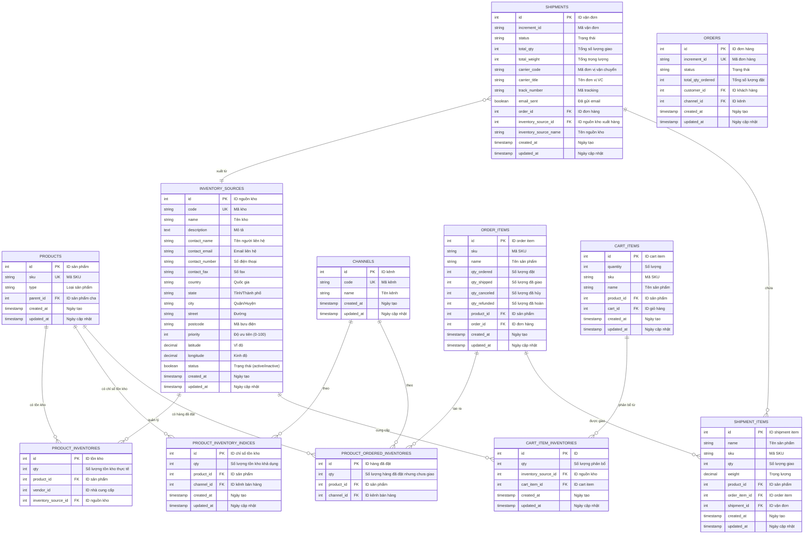

# ERD - INVENTORY MANAGEMENT (Quản lý kho)

## Sơ đồ ERD mức khái niệm



## Mô tả các bảng chính

### 1. INVENTORY_SOURCES (Nguồn kho)
- Quản lý các kho hàng/warehouse
- Lưu trữ thông tin địa lý để tính khoảng cách và phí vận chuyển
- Priority: Độ ưu tiên khi phân bổ hàng (số càng nhỏ càng ưu tiên)
- Hỗ trợ multi-warehouse system

### 2. PRODUCT_INVENTORIES (Tồn kho thực tế)
- Lưu số lượng tồn kho thực tế của sản phẩm tại từng kho
- Unique constraint: `(product_id, inventory_source_id, vendor_id)`
- Được cập nhật khi:
  - Nhập hàng (+)
  - Xuất hàng khi giao (-)
  - Điều chỉnh kho
  - Hoàn hàng (+)

### 3. PRODUCT_INVENTORY_INDICES (Tồn kho khả dụng)
- Là bảng index/cache để query nhanh tồn kho khả dụng
- Tính toán: `qty = Σ(PRODUCT_INVENTORIES.qty) - PRODUCT_ORDERED_INVENTORIES.qty`
- Được tổng hợp theo channel
- Cập nhật bất đồng bộ (background job)

### 4. PRODUCT_ORDERED_INVENTORIES (Hàng đã đặt)
- Lưu số lượng hàng đã được đặt nhưng chưa xuất kho
- Unique constraint: `(product_id, channel_id)`
- Được cập nhật khi:
  - Tạo đơn hàng (+)
  - Xuất hàng/giao hàng (-)
  - Hủy đơn hàng (-)

### 5. CART_ITEM_INVENTORIES (Phân bổ tồn kho giỏ hàng)
- Phân bổ số lượng sản phẩm từ các kho khác nhau
- Giúp reserve tồn kho tạm thời cho giỏ hàng
- Tổng qty phải bằng quantity của cart_item

### 6. SHIPMENTS & SHIPMENT_ITEMS (Vận đơn)
- Tracking quá trình xuất kho và giao hàng
- Liên kết với INVENTORY_SOURCE để biết hàng xuất từ kho nào
- Cập nhật qty_shipped của ORDER_ITEMS

## Quy trình nghiệp vụ

### 1. Kiểm tra tồn kho khi thêm vào giỏ

```
1. Lấy quantity cần thêm
2. Query PRODUCT_INVENTORY_INDICES:
   - WHERE product_id = ? AND channel_id = ?
   - Check: available_qty >= requested_qty
3. Nếu đủ hàng:
   - Tạo/Cập nhật CART_ITEMS
   - Phân bổ CART_ITEM_INVENTORIES theo priority của INVENTORY_SOURCES
4. Nếu không đủ:
   - Hiển thị thông báo "Out of stock" hoặc "Only X available"
```

### 2. Đặt hàng (Order Placement)

```
1. Validate tồn kho lần cuối
2. Tạo ORDER từ CART
3. Tăng PRODUCT_ORDERED_INVENTORIES:
   - qty += order_item.qty_ordered
4. Background job cập nhật PRODUCT_INVENTORY_INDICES:
   - qty = actual_inventory - ordered_inventory
5. Clear CART_ITEM_INVENTORIES
```

### 3. Xuất kho và giao hàng (Shipping)

```
1. Chọn INVENTORY_SOURCE để xuất hàng (theo priority hoặc gần khách nhất)
2. Tạo SHIPMENT:
   - Gán inventory_source_id
   - Tạo SHIPMENT_ITEMS từ ORDER_ITEMS
3. Giảm PRODUCT_INVENTORIES tại kho xuất:
   - qty -= shipment_item.qty
4. Giảm PRODUCT_ORDERED_INVENTORIES:
   - qty -= shipment_item.qty
5. Cập nhật ORDER_ITEMS:
   - qty_shipped += shipment_item.qty
6. Background job cập nhật PRODUCT_INVENTORY_INDICES
```

### 4. Hủy đơn (Order Cancellation)

```
1. Lấy ORDER_ITEMS với qty chưa ship
2. Giảm PRODUCT_ORDERED_INVENTORIES:
   - qty -= (order_item.qty_ordered - order_item.qty_shipped)
3. Cập nhật ORDER_ITEMS:
   - qty_canceled = qty_ordered - qty_shipped
4. Background job cập nhật PRODUCT_INVENTORY_INDICES:
   - Tồn kho khả dụng tăng lên
```

### 5. Hoàn hàng (Refund/Return)

```
1. Tạo REFUND với REFUND_ITEMS
2. Khi hàng về kho:
   - Chọn INVENTORY_SOURCE nhận hàng
   - Tăng PRODUCT_INVENTORIES.qty
   - Cập nhật ORDER_ITEMS.qty_refunded
3. Background job cập nhật PRODUCT_INVENTORY_INDICES
```

### 6. Nhập hàng (Stock Receiving)

```
1. Chọn INVENTORY_SOURCE
2. Nhập số lượng cho từng sản phẩm
3. Tăng PRODUCT_INVENTORIES:
   - qty += received_qty
4. Background job cập nhật PRODUCT_INVENTORY_INDICES
```

### 7. Điều chuyển kho (Stock Transfer)

```
1. Chọn source_warehouse và destination_warehouse
2. Giảm PRODUCT_INVENTORIES tại source:
   - qty -= transfer_qty
3. Tăng PRODUCT_INVENTORIES tại destination:
   - qty += transfer_qty
4. Background job cập nhật PRODUCT_INVENTORY_INDICES
```

## Công thức tính toán

### Tồn kho khả dụng (Available Stock):
```
available_qty = Σ(PRODUCT_INVENTORIES.qty for all sources) 
              - PRODUCT_ORDERED_INVENTORIES.qty
```

### Tồn kho theo kho (Stock per Warehouse):
```
warehouse_stock = PRODUCT_INVENTORIES.qty 
                WHERE inventory_source_id = ?
```

### Allocation Strategy (Phân bổ kho):
```
1. Sort INVENTORY_SOURCES by priority ASC
2. For each source with status = 1:
   - Check PRODUCT_INVENTORIES.qty > 0
   - Allocate min(required_qty, available_qty)
   - required_qty -= allocated_qty
   - If required_qty = 0: break
```

## Ràng buộc quan trọng

1. **Non-negative Stock**: `PRODUCT_INVENTORIES.qty >= 0`
2. **Inventory Balance**: 
   ```
   PRODUCT_INVENTORY_INDICES.qty = 
       Σ(PRODUCT_INVENTORIES.qty) - PRODUCT_ORDERED_INVENTORIES.qty
   ```
3. **Cart Allocation**: 
   ```
   Σ(CART_ITEM_INVENTORIES.qty) = CART_ITEMS.quantity
   ```
4. **Shipment Quantity**: 
   ```
   Σ(SHIPMENT_ITEMS.qty) <= ORDER_ITEMS.qty_ordered
   ```
5. **Ordered Inventory**: 
   ```
   PRODUCT_ORDERED_INVENTORIES.qty >= 0
   ```

## Các chỉ số quan trọng (KPIs)

1. **Stock Level**: Số lượng tồn kho hiện tại
2. **Available Stock**: Tồn kho khả dụng (trừ đi đã đặt)
3. **Pending Orders**: Số lượng hàng đã đặt chưa giao
4. **Stock Turnover**: Vòng quay kho
5. **Out of Stock Rate**: Tỷ lệ hết hàng
6. **Warehouse Utilization**: Tỷ lệ sử dụng kho

## Các trạng thái quan trọng

### Shipment Status:
- `pending`: Chờ chuẩn bị hàng
- `processing`: Đang đóng gói
- `ready_to_ship`: Sẵn sàng giao
- `shipped`: Đã giao cho đơn vị vận chuyển
- `delivered`: Đã giao thành công
- `returned`: Đã hoàn trả

### Inventory Source Status:
- `1` (active): Đang hoạt động
- `0` (inactive): Tạm ngưng

## Chiến lược phân bổ kho (Allocation Strategy)

1. **Priority-based**: Ưu tiên theo INVENTORY_SOURCES.priority
2. **Distance-based**: Ưu tiên kho gần khách hàng nhất (dựa vào latitude/longitude)
3. **Stock level-based**: Ưu tiên kho có nhiều hàng nhất
4. **Hybrid**: Kết hợp các yếu tố trên
