# ERD - CUSTOMER MANAGEMENT (Quản lý khách hàng)

## Sơ đồ ERD mức khái niệm

```mermaid
erDiagram
    CUSTOMERS ||--o{ CUSTOMER_ADDRESSES : "có"
    CUSTOMERS }o--|| CUSTOMER_GROUPS : "thuộc"
    CUSTOMERS ||--o{ ORDERS : "đặt"
    CUSTOMERS ||--o{ CART : "có"
    CUSTOMERS ||--o{ WISHLIST_ITEMS : "có"
    CUSTOMERS ||--o{ COMPARE_ITEMS : "có"
    CUSTOMERS ||--o{ PRODUCT_REVIEWS : "viết"
    CUSTOMERS ||--o{ CUSTOMER_NOTES : "có"
    CUSTOMERS ||--o{ CUSTOMER_SOCIAL_ACCOUNTS : "liên kết"
    PRODUCTS ||--o{ WISHLIST_ITEMS : "trong"
    PRODUCTS ||--o{ COMPARE_ITEMS : "trong"
    PRODUCTS ||--o{ PRODUCT_REVIEWS : "được đánh giá"
    PRODUCT_REVIEWS ||--o{ PRODUCT_REVIEW_ATTACHMENTS : "có"

    CUSTOMERS {
        int id PK "ID khách hàng"
        string first_name "Tên"
        string last_name "Họ"
        string gender "Giới tính (Male/Female/Other)"
        date date_of_birth "Ngày sinh"
        string email UK "Email"
        string phone UK "Số điện thoại"
        string image "Ảnh đại diện"
        tinyint status "Trạng thái (1=active, 0=inactive)"
        string password "Mật khẩu đã hash"
        string api_token UK "API token để xác thực"
        int customer_group_id FK "ID nhóm khách hàng"
        boolean subscribed_to_news_letter "Đăng ký nhận tin"
        boolean is_verified "Đã xác thực email"
        tinyint is_suspended "Bị tạm ngưng (1=yes, 0=no)"
        string token "Token xác thực email"
        text notes "Ghi chú nội bộ"
        string remember_token "Token remember me"
        timestamp created_at "Ngày đăng ký"
        timestamp updated_at "Ngày cập nhật"
    }

    CUSTOMER_GROUPS {
        int id PK "ID nhóm khách hàng"
        string code UK "Mã nhóm"
        string name "Tên nhóm"
        boolean is_user_defined "Do người dùng định nghĩa"
        timestamp created_at "Ngày tạo"
        timestamp updated_at "Ngày cập nhật"
    }

    CUSTOMER_ADDRESSES {
        int id PK "ID địa chỉ"
        string address_type "Loại địa chỉ (customer, order_shipping, order_billing...)"
        int customer_id FK "ID khách hàng"
        int cart_id FK "ID giỏ hàng (nếu là địa chỉ checkout)"
        int order_id FK "ID đơn hàng (nếu là địa chỉ order)"
        string first_name "Tên"
        string last_name "Họ"
        string gender "Giới tính"
        string company_name "Tên công ty"
        string address "Địa chỉ chi tiết"
        string city "Thành phố"
        string state "Tỉnh/Thành"
        string country "Quốc gia"
        string postcode "Mã bưu điện"
        string email "Email"
        string phone "Số điện thoại"
        string vat_id "Mã số thuế"
        boolean default_address "Địa chỉ mặc định"
        json additional "Dữ liệu bổ sung"
        timestamp created_at "Ngày tạo"
        timestamp updated_at "Ngày cập nhật"
    }

    WISHLIST_ITEMS {
        int id PK "ID"
        int channel_id FK "ID kênh"
        int product_id FK "ID sản phẩm"
        int customer_id FK "ID khách hàng"
        json additional "Dữ liệu bổ sung (options...)"
        boolean moved_to_cart "Đã chuyển vào giỏ"
        boolean shared "Đã chia sẻ"
        timestamp time_of_moving "Thời gian chuyển giỏ"
        timestamp created_at "Ngày thêm"
        timestamp updated_at "Ngày cập nhật"
    }

    COMPARE_ITEMS {
        int id PK "ID"
        int product_id FK "ID sản phẩm"
        int customer_id FK "ID khách hàng"
        timestamp created_at "Ngày thêm"
        timestamp updated_at "Ngày cập nhật"
    }

    PRODUCT_REVIEWS {
        int id PK "ID đánh giá"
        string title "Tiêu đề"
        decimal rating "Điểm đánh giá (1.0-5.0)"
        text comment "Nội dung đánh giá"
        string status "Trạng thái (approved, pending, disapproved)"
        int product_id FK "ID sản phẩm"
        int customer_id FK "ID khách hàng"
        string name "Tên người đánh giá"
        timestamp created_at "Ngày đánh giá"
        timestamp updated_at "Ngày cập nhật"
    }

    PRODUCT_REVIEW_ATTACHMENTS {
        int id PK "ID"
        int review_id FK "ID đánh giá"
        string type "Loại (image, video)"
        string mime_type "MIME type"
        string path "Đường dẫn file"
        timestamp created_at "Ngày tạo"
        timestamp updated_at "Ngày cập nhật"
    }

    CUSTOMER_NOTES {
        int id PK "ID ghi chú"
        int customer_id FK "ID khách hàng"
        text note "Nội dung ghi chú"
        boolean customer_notified "Đã thông báo khách"
        timestamp created_at "Ngày tạo"
        timestamp updated_at "Ngày cập nhật"
    }

    CUSTOMER_SOCIAL_ACCOUNTS {
        int id PK "ID"
        int customer_id FK "ID khách hàng"
        string provider_name "Tên nhà cung cấp (facebook, google, twitter...)"
        string provider_id "ID từ provider"
        timestamp created_at "Ngày liên kết"
        timestamp updated_at "Ngày cập nhật"
    }

    ORDERS {
        int id PK "ID đơn hàng"
        string increment_id UK "Mã đơn hàng"
        string status "Trạng thái"
        boolean is_guest "Đơn khách vãng lai"
        string customer_email "Email khách hàng"
        string customer_first_name "Tên khách hàng"
        string customer_last_name "Họ khách hàng"
        decimal grand_total "Tổng tiền"
        int customer_id FK "ID khách hàng"
        timestamp created_at "Ngày đặt"
        timestamp updated_at "Ngày cập nhật"
    }

    CART {
        int id PK "ID giỏ hàng"
        string customer_email "Email khách hàng"
        string customer_first_name "Tên"
        string customer_last_name "Họ"
        boolean is_guest "Khách vãng lai"
        boolean is_active "Đang hoạt động"
        int customer_id FK "ID khách hàng"
        timestamp created_at "Ngày tạo"
        timestamp updated_at "Ngày cập nhật"
    }

    PRODUCTS {
        int id PK "ID sản phẩm"
        string sku UK "Mã SKU"
        string type "Loại sản phẩm"
        timestamp created_at "Ngày tạo"
        timestamp updated_at "Ngày cập nhật"
    }
```



## Mô tả các bảng chính

### 1. CUSTOMERS (Khách hàng)
- Lưu trữ thông tin cá nhân khách hàng
- Hỗ trợ đăng ký qua email hoặc social login
- Email và phone là unique để tránh trùng lặp
- Có thể tạm ngưng (suspend) hoặc vô hiệu hóa tài khoản
- Hỗ trợ API token cho mobile app

### 2. CUSTOMER_GROUPS (Nhóm khách hàng)
- Phân loại khách hàng (VIP, Wholesale, Retail, General...)
- Áp dụng giá đặc biệt, chương trình khuyến mãi riêng
- Có thể gán quyền truy cập khác nhau

### 3. CUSTOMER_ADDRESSES (Địa chỉ khách hàng)
- Lưu nhiều địa chỉ cho mỗi khách hàng
- Phân loại: customer (địa chỉ lưu), order_shipping, order_billing
- Hỗ trợ địa chỉ mặc định
- Dùng cho checkout và tính phí vận chuyển

### 4. WISHLIST_ITEMS (Danh sách yêu thích)
- Khách hàng có thể lưu sản phẩm yêu thích
- Track được khi nào chuyển vào giỏ hàng
- Hỗ trợ chia sẻ wishlist với người khác

### 5. COMPARE_ITEMS (So sánh sản phẩm)
- Cho phép khách hàng so sánh nhiều sản phẩm cùng lúc
- Giúp khách hàng đưa ra quyết định mua hàng

### 6. PRODUCT_REVIEWS (Đánh giá sản phẩm)
- Khách hàng đánh giá sản phẩm đã mua
- Rating từ 1-5 sao
- Có trạng thái duyệt (approved, pending, disapproved)
- Hỗ trợ đính kèm hình ảnh/video qua PRODUCT_REVIEW_ATTACHMENTS

### 7. CUSTOMER_NOTES (Ghi chú khách hàng)
- Admin/Sales có thể ghi chú về khách hàng
- Hỗ trợ thông báo cho khách hàng nếu cần

### 8. CUSTOMER_SOCIAL_ACCOUNTS (Tài khoản mạng xã hội)
- Liên kết tài khoản với Facebook, Google, Twitter...
- Cho phép đăng nhập nhanh qua social login

## Quy trình nghiệp vụ

### 1. Đăng ký khách hàng mới

```
1. Khách hàng nhập thông tin đăng ký:
   - Email, Password, First Name, Last Name
   - Phone (optional)
2. Validate:
   - Email chưa tồn tại
   - Phone chưa tồn tại (nếu có)
   - Password đủ mạnh
3. Tạo CUSTOMERS:
   - Hash password
   - Generate token xác thực email
   - Set is_verified = 0
   - Set status = 0 (nếu cần xác thực)
4. Gửi email xác thực
5. Khách hàng click link xác thực:
   - Set is_verified = 1
   - Set status = 1
   - Clear token
```

### 2. Đăng nhập bằng Social Account

```
1. Khách hàng chọn đăng nhập bằng Facebook/Google
2. OAuth flow: Lấy provider_id, email, name
3. Kiểm tra CUSTOMER_SOCIAL_ACCOUNTS:
   - Nếu tồn tại: Đăng nhập
   - Nếu không:
     a. Kiểm tra CUSTOMERS có email này chưa
     b. Nếu có: Liên kết account
     c. Nếu không: Tạo CUSTOMERS mới + liên kết
4. Tạo/cập nhật CUSTOMER_SOCIAL_ACCOUNTS
5. Set session và redirect
```

### 3. Quản lý địa chỉ

```
# Thêm địa chỉ mới
1. Khách hàng nhập thông tin địa chỉ
2. Tạo CUSTOMER_ADDRESSES:
   - address_type = 'customer'
   - customer_id = current_user_id
3. Nếu chọn "Set as default":
   - Cập nhật default_address = 0 cho tất cả địa chỉ cũ
   - Set default_address = 1 cho địa chỉ mới

# Chọn địa chỉ khi checkout
1. Lấy danh sách CUSTOMER_ADDRESSES của khách hàng
2. Hiển thị để chọn shipping address và billing address
3. Có thể nhập địa chỉ mới tại checkout
4. Khi tạo ORDER, copy địa chỉ sang ORDER_ADDRESSES
```

### 4. Wishlist

```
# Thêm vào wishlist
1. Khách hàng click "Add to Wishlist"
2. Kiểm tra đã tồn tại chưa:
   - WHERE customer_id = ? AND product_id = ?
3. Nếu chưa: Tạo WISHLIST_ITEMS mới
4. Nếu có rồi: Thông báo "Already in wishlist"

# Chuyển wishlist sang cart
1. Khách hàng click "Move to Cart" trên wishlist item
2. Thêm vào CART_ITEMS
3. Cập nhật WISHLIST_ITEMS:
   - moved_to_cart = 1
   - time_of_moving = NOW()

# Chia sẻ wishlist
1. Khách hàng click "Share Wishlist"
2. Generate public URL
3. Set shared = 1
4. Người khác truy cập URL có thể xem wishlist (read-only)
```

### 5. Product Review

```
# Viết đánh giá
1. Khách hàng phải đã mua sản phẩm (kiểm tra ORDER_ITEMS)
2. Nhập rating (1-5), title, comment
3. Upload hình ảnh/video (optional)
4. Tạo PRODUCT_REVIEWS:
   - status = 'pending' (chờ duyệt)
5. Upload attachments vào PRODUCT_REVIEW_ATTACHMENTS
6. Thông báo cho admin có review mới cần duyệt

# Duyệt đánh giá (Admin)
1. Admin xem review pending
2. Kiểm tra nội dung
3. Cập nhật status:
   - 'approved': Hiển thị công khai
   - 'disapproved': Không hiển thị
```

### 6. Phân nhóm khách hàng

```
# Tự động phân nhóm
1. Background job chạy định kỳ
2. Tính toán metrics:
   - Total orders
   - Total spent
   - Average order value
   - Days since last order
3. Áp dụng rules phân loại:
   - VIP: Total spent > $10,000
   - Loyal: Total orders > 50
   - Regular: Active trong 90 ngày
   - Inactive: Không hoạt động > 180 ngày
4. Cập nhật CUSTOMERS.customer_group_id

# Thủ công phân nhóm
1. Admin chọn khách hàng
2. Chọn CUSTOMER_GROUP
3. Cập nhật customer_group_id
```

### 7. Suspend/Unsuspend Account

```
# Suspend
1. Admin/System phát hiện vi phạm
2. Cập nhật CUSTOMERS:
   - is_suspended = 1
3. Khách hàng không thể đăng nhập
4. Thông báo qua email

# Unsuspend
1. Admin review và quyết định
2. Cập nhật CUSTOMERS:
   - is_suspended = 0
3. Thông báo qua email
```

## Báo cáo và Phân tích khách hàng

### 1. Customer Lifetime Value (CLV)
```sql
SELECT 
    customer_id,
    COUNT(*) as total_orders,
    SUM(grand_total) as lifetime_value,
    AVG(grand_total) as avg_order_value
FROM orders
WHERE customer_id IS NOT NULL
GROUP BY customer_id
ORDER BY lifetime_value DESC
```

### 2. Customer Segmentation
```sql
SELECT 
    cg.name as group_name,
    COUNT(c.id) as customer_count,
    AVG(order_stats.total_spent) as avg_lifetime_value
FROM customers c
LEFT JOIN customer_groups cg ON c.customer_group_id = cg.id
LEFT JOIN (
    SELECT customer_id, SUM(grand_total) as total_spent
    FROM orders
    GROUP BY customer_id
) order_stats ON c.id = order_stats.customer_id
GROUP BY cg.id
```

### 3. Customer Retention Rate
```sql
-- Khách hàng quay lại mua trong tháng
SELECT 
    DATE_FORMAT(created_at, '%Y-%m') as month,
    COUNT(DISTINCT customer_id) as returning_customers
FROM orders
WHERE customer_id IN (
    SELECT customer_id 
    FROM orders 
    GROUP BY customer_id 
    HAVING COUNT(*) > 1
)
GROUP BY month
```

### 4. Active Customers
```sql
SELECT COUNT(DISTINCT customer_id)
FROM orders
WHERE created_at >= DATE_SUB(NOW(), INTERVAL 90 DAY)
  AND customer_id IS NOT NULL
```

## Các chỉ số quan trọng (KPIs)

1. **Total Customers**: Tổng số khách hàng
2. **Active Customers**: Khách hàng có đơn trong 90 ngày
3. **New Customers**: Khách hàng mới trong kỳ
4. **Customer Retention Rate**: Tỷ lệ giữ chân khách hàng
5. **Average CLV**: Giá trị trung bình mỗi khách hàng
6. **Churn Rate**: Tỷ lệ khách hàng rời bỏ
7. **Email Verification Rate**: Tỷ lệ xác thực email
8. **Newsletter Subscription Rate**: Tỷ lệ đăng ký nhận tin

## Quyền riêng tư và GDPR

### Data Privacy
- Khách hàng có quyền xem dữ liệu cá nhân
- Khách hàng có quyền xóa tài khoản (Right to be forgotten)
- Password phải được hash (bcrypt)
- Sensitive data cần được mã hóa

### GDPR Compliance
- Lưu consent cho newsletter subscription
- Cho phép khách hàng export data
- Xóa data khi khách hàng yêu cầu (có thể anonymize thay vì xóa hoàn toàn để giữ order history)
